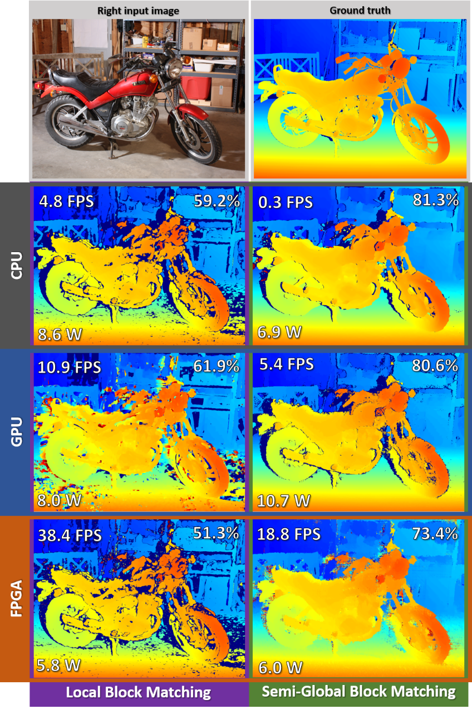

# High performance embedded systems for stereoscopic vision
This repository includes the files to build the embedded stereo vision implementations, developed for the thesis **High Performance Embedded Systems for Stereoscopic Vision** which aims to extract real-time 3D information about the environment using stereoscopic vision in space; it was developed for the Integrated 3D Sensors project I3DS (Integrated 3D sensors).  

Stereo vision presents two significant challenges first is the correspondence problem; finding for every pixel it’s corresponding pixel in the other image, two approaches for solving this problem are explored in this thesis **local-based approach** and **semi-global based approach**. The second challenge is the high throughput of data, making it challenging to implement a system that provides high frame rates with low power consumption, different embedded architectures are explored in this thesis; embedded CPU, embedded GPU, and FPGA to mitigate that problem. The use of hardware accelerators (FPGA and GPU) provides better performance but at a significantly higher development costs, and time, so this project exploits modern software tools to accelerate the embedded development, OpenCV on the embedded CPU, CUDA implementation of OpenCV and libsgm on the embedded GPU, and the new library by Xilinx XFopenCV synthesized for the FPGA.
## FPGA implementation
The FPGA accelerated embedded stereo system is implemented on the Trenz Electronic Starter Kit TE0808-04-09-2IE-S consisting of a TE0808-04-09EG-2IE system on module featuring a ZU9EG Zynq Ultrascale+ chip mounted on a TEBF0808-04 base board.
The embedded stereo system was developed using the Xilinx toolchain and the **OpenCV** and **XFOpenCV** libraries, the system developed for this project is included in the **FPGA** folder within this repository, the **FPGA/TrenzPlatform** folder includes the hardware and software platforms developed to allow for the SDSoC development,**FPGA/tzPetalinux.bsp** is the board support package generated for the operating system used on board, and finally **FPGA/src** folder includes the hardware accelerated stereo system implementation for the Zynq Ultrascale+ architecture.
## GPU implementation
The GPU accelerated embedded stereo system is implemented on the The NVIDIA Jetson TX2 Developer Kit which features a Jetson TX2 System on Module.
The embedded stereo system is developed using the libraries **CUDA**, **OpenCV** and **libsgm**, and the source files for this project is included in the **GPU/StereoPipeline** folder.
## CPU implementation
The CPU embedded stereo system implementation was developed to run on the ARM cortex A57 quad core CPU, on the NVIDIA Jetson TX2, and is included in the GPU implementation folder.   
Google benchmark library was used to benchmark the implementations' performance.
